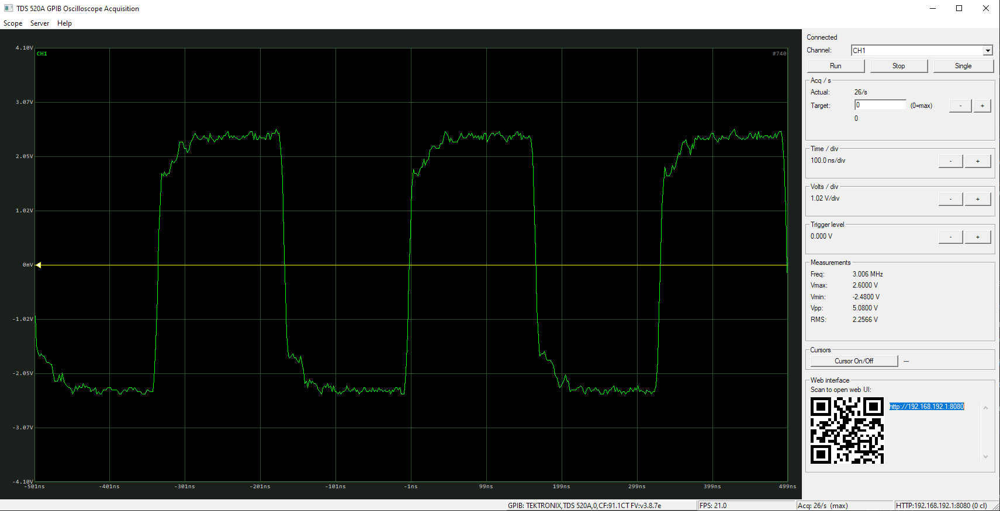
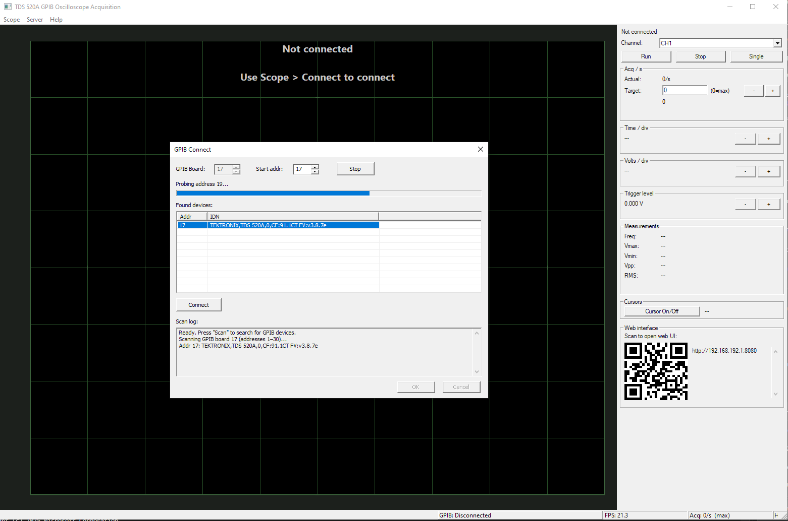
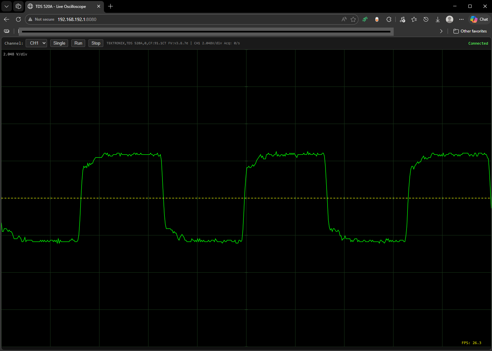

# TDS 520A GPIB — Live Oscilloscope Viewer

Real-time waveform acquisition and display for the **Tektronix TDS 520A** digital oscilloscope over **NI-488.2 GPIB**.


---

## Screenshots







---

## Features

- **Live waveform display** — up to ~20–30 acquisitions/second
- **Scope-accurate rendering** — V/div and s/div match the oscilloscope screen exactly
- **MFC desktop UI** — oscilloscope-style grid, trigger line, axis labels, cursors
- **Embedded web interface** — connect any browser on the local network (`http://<ip>:8080`)
- **QR code** in the control panel for quick mobile access
- **Single-thread GPIB architecture** — all GPIB calls serialized through one acquisition thread
- **Preamble caching** — `WFMPRE?` only re-fetched when settings change
- **Single `ibrd` per frame** — one GPIB round-trip per waveform

---

## Hardware Requirements

| Item | Details |
|------|---------|
| Oscilloscope | Tektronix TDS 520A (tested) |
| GPIB interface | NI GPIB-USB-HS or compatible NI-488.2 adapter |
| GPIB board index | **17** (`GPIB17`) |
| Oscilloscope address | **17** |
| OS | Windows 10/11 (x86 or x64) |
| Driver | NI-488.2 runtime installed |

---

## Building

### Prerequisites

- Visual Studio 2019 or 2022 with **MFC** and **C++ Desktop** workload
- NI-488.2 driver (for `ni488.h` and `gpib-32.lib`)

### Steps

1. Clone the repository:
   ```
   git clone https://github.com/<your-username>/TDS_520A_GPIB.git
   ```
2. Open `TDS520A\TDS520A.sln` in Visual Studio
3. Set configuration to **Debug | Win32** (or Release)
4. Build ? **Ctrl+Shift+B**

Output: `TDS520A\bin\Debug\TDS520A.exe`

---

## Usage

1. Connect the oscilloscope to the PC via GPIB-USB adapter
2. Launch `TDS520A.exe`
3. Click **Connect** ? select board **17**, address **17** ? **OK**
4. Click **Run** to start live acquisition
5. Scan the QR code in the control panel or open `http://<your-ip>:8080` in a browser for the web view

### Control Panel

| Control | Function |
|---------|----------|
| **Run / Stop / Single** | Start continuous, stop, or arm single-shot acquisition |
| **Channel** | Switch active channel (CH1–CH4) |
| **Acq/s** | Set target acquisition rate (0 = unlimited) |
| **Time/div ±** | Adjust horizontal scale on the oscilloscope |
| **Volts/div ±** | Adjust vertical scale on the oscilloscope |
| **Trigger level ±** | Adjust trigger level (±0.1 V steps) |
| **Cursor On/Off** | Toggle time/voltage cursors on the waveform view |
| **QR code** | Scan to open the web interface on a phone/tablet |

---

## Architecture

```
CTds520AApp
  +-- TektronixScope        GPIB driver (connect, SetChannel, FetchWaveform)
  +-- AcquisitionThread     Sole GPIB owner — drains command queue, fetches waveforms
  |     +-- WaveformDecoder ADC bytes -> voltage/time samples
  +-- WaveformRingBuffer    Lock-free waveform queue
  +-- HttpServer            Embedded HTTP + WebSocket server (port 8080)
  |     +-- HtmlGenerator   Inline HTML/JS oscilloscope page
  +-- MFC UI
        +-- OscilloscopeView  GDI double-buffered waveform renderer
        +-- ScopeControlPanel Settings, stats, QR code
```

### GPIB Thread Safety

> **Only `AcquisitionThread` may call GPIB functions.**

The UI and HTTP server post `ScopeCommand` values to a mutex-protected queue.
`AcquisitionThread::DrainCommandQueue()` executes them at the start of each cycle.

### Waveform Rendering

The renderer maps data using scope divisions (not signal min/max), so the display matches the oscilloscope exactly:

```
xScale = screenW / (hDivisions × secPerDiv)   // 10 horizontal divisions
yScale = screenH / (vDivisions × voltsPerDiv)  // 8 vertical divisions
yCenter = 0 V  (0 V at screen centre)
xCenter = midpoint of record
```

---

## Performance

| Setting | Value |
|---------|-------|
| Record length | 250 points (configurable via `DataStartStop()`) |
| GPIB reads per frame | **1** (`ibrd` of ~256 bytes) |
| Achieved rate (NI GPIB-USB-HS) | **~20–30 acq/s** |
| Preamble refresh | Only on settings change |
| GPIB timeout | T3s (3 seconds) |

---

## License

MIT License. See [LICENSE](LICENSE) for details.

Third-party components:
- [QR Code generator library](https://github.com/nayuki/QR-Code-generator) by Project Nayuki — MIT License
